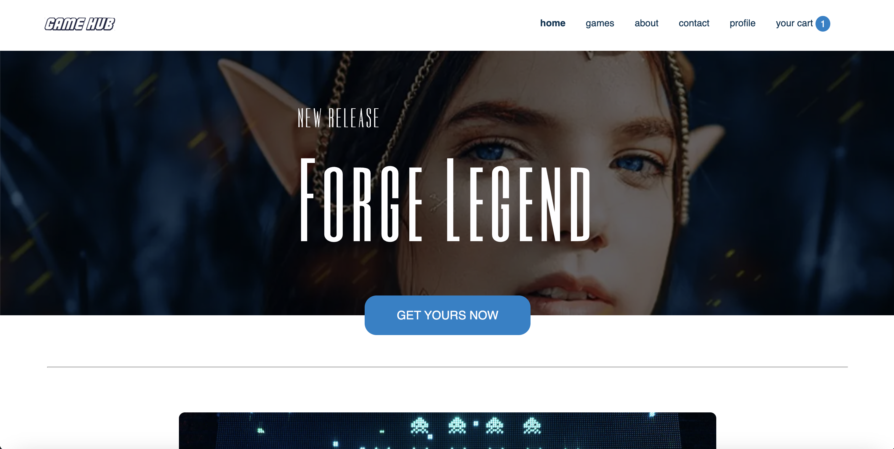

# GAMEHUB



**Deployed site:** [Gamehub](https://gamehub-tele.netlify.app/)<br/>
This is a prototype e-commerce website.<br/>
Designed and built during my first year at Noroff School of Technology and Media.

## Description

Gamehub is an online community and store for gaming, where the audience can buy games, create users and login to sell their own.<br/>
_NOTE!_ At the moment, user creation is not up and running yet, so login will only be a simulation. Profile page remains to be created.

Nothing you do at this website will have a real-life effect. Meaning that you can go through the events of purchase, without the purchase actually going through.

**Key features:**

- Products fetched from a Wordpress instance utilising the WP REST API
- Simple and sharp search engine in products page
- Article modal at landing page opening articles in it's own view

## Built With

- Javascript
- HTML and CSS
- node.js
- Wordpress REST API
- **IDE:** Visual Studio Code

## How to run it locally

1. Clone the repo:

```bash
git clone git@github.com:telecasteren/gamehub.git
```

2. Run the website locally with Live server

You can play around with it as you like at your machine, and if you want to make a contribution --> read more in the [Contributing](#contributing) section.

## Contributing

Interesting in contributing?<br/>
You are welcome to do so, find out about how here:
[CONTRIBUTING](CONTRIBUTING.md)

## Contact

You can find me and my other projects here:

- [My portfolio page](https://telecasteren.github.io/)
- [My website - telecasternilsen](https://telecasternilsen.netlify.app/)
- [GitHub profile](https://github.com/telecasteren)
- [LinkedIn profile](https://www.linkedin.com/in/tele-caster-nilsen-7002b9249/)

## Acknowledgments

### LANDING PAGE CAROUSEL PHOTOS

Found at

- tomsguide.com
- slate.com

Thank you kindly!

### LANDING PAGE ARTICLE PHOTOS

(under free licence on Unsplash)

Special thanks to the artists
Sean Whelan,
Kelly Sikkema and
Andre Hunter
at Unsplash

---

### LANDING PAGE ARTICLE TEXT

Ideas and subjects by me, text written by ChatGPT
